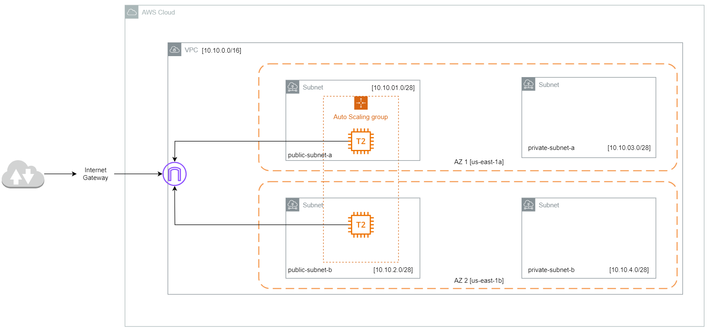

# Architecture for this build.

For this Project, I took what I already built in the AWS Console but used Terraform to depoly it as code. See docs/build.txt for walkthough and notes for manual buildout. 

This was a fun one and gave me an idea of how complex and fine granied you can get when building infrastructure. 

Creating the VPC was a breeze, I had some pain points throughout the project but over with the help of google, stakoverflow and hashi docs I was able to get this spun up without going bald. Some lessons learned: Like every other coding lang there are various was to acheieve the same thing but some ways may conflict with other things you try to do down the line.

To test that this build was able to actually scale. I went into the instance and installed "stress" to up the CPU percentage. Once the CPU went over 50% util another image popped up to help the load, then when the avg CPU % went under 10% you could see the oldest image being spun down.

The code is able to be deployed and build a HA and scalable env (not secure bc the sg is open to everyone). However, just like in project .5 my code is all in one and isn't structured the best. Going forward I will try to utilize things like modules variables to clean up and reuse code so that I don't need to spend time recoding things I've already build like VPC's.   

This was a fun one, it also really enforced the idea of how cool Terraformn actually is. Exicted to build more complex architecture.

